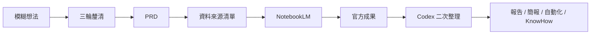

很多人使用 AI 工具時，第一個困難其實不是「不會下指令」，而是還沒把問題說清楚。

例如：

- 我想整理問卷。
- 我想做主管簡報。
- 我想把資料丟進 NotebookLM 分析。
- 我想讓 Google 表單送出後自動寄信。
- 我想把這次做法保存成下次可重用的方法。

這些想法都合理，但如果直接要求 AI 產出成品，常常會得到一份看起來漂亮、實際上不好落地的答案，特別是我在教學、顧問的經驗之中，在沒有很有效的框架思考之下，時常需要進一步的釐清與討論。

所以我整理了一個公開 Codex Skill：

https://github.com/willismax/notebooklm-workflow-coach

它的目標不是替你按一個魔法按鈕，而是陪你把一個模糊情境，整理成可以執行、可以查證、可以重複使用的 NotebookLM + Google Workspace 工作流，而這個工作流是基於一套系統化的思考框架、落實為6周訓練課程後得到的歸納與實踐成果。

<!-- truncate -->

## 這個 Skill 解決什麼問題

`notebooklm-workflow-coach` 會先用三輪對話幫你釐清：

1. 你的情境與痛點是什麼。
2. 你有哪些資料來源，以及哪些資料不能上傳 AI。
3. 你希望最後產出什麼，怎樣才算有用。

接著它會產生：

- PRD
- 資料來源清單
- NotebookLM 筆記本規劃
- NotebookLM 提示詞
- Google 表單、試算表、文件、Drive、Apps Script 的分工
- 報告、簡報、Podcast、Infographic 或 Data Table 的產出建議
- 風險檢查表
- 下次可重用的 Prompt 或 KnowHow

這讓 Codex 比較像一個工作流中樞，而 NotebookLM 則是來源分析層。



## 安裝方式

先下載或 clone repo：

```bash
git clone https://github.com/willismax/notebooklm-workflow-coach.git
```

把這個資料夾放到 Codex skills 目錄：

```text
skills/notebooklm-workflow-coach
```

接著重新啟動 Codex 或開新對話。

## 第一句話怎麼下

你可以直接貼這句：

```text
使用 notebooklm-workflow-coach。我想用 NotebookLM 與 Google 雲端工具完成一個工作、研究、學習或生活任務，請先用三輪對話幫我釐清需求並產生 PRD。
```

如果你已經有具體情境，可以這樣說：

```text
使用 notebooklm-workflow-coach。
我每週都要整理客戶回饋與服務紀錄，想找出常見問題、產生改善建議，並做成主管簡報。
我有 Google 表單回覆、試算表、幾份服務 SOP 文件。
請先用三輪對話幫我釐清需求，產生 PRD，並規劃 NotebookLM、Google 試算表、Google 文件與 Apps Script 可以怎麼串。
```

## 三輪對話長什麼樣子


第一輪通常會釐清情境：

```text
這件事發生在哪個工作或生活場景？
目前最麻煩、最花時間、最容易出錯的是什麼？
做完後誰會看或使用成果？
你希望最後得到什麼？
```

第二輪會釐清資料：

```text
你手上有哪些資料來源？
哪些資料有個資、商業機密或不能上傳到 AI？
你目前能使用哪些工具？
你希望今天完成，還是可以分階段完成？
```

第三輪會釐清成功標準：

```text
這份成果要幫你做什麼決定？
成果要用什麼格式交付？
什麼樣的結果你會覺得真的有用？
這是一次性任務，還是之後要定期重複？
```

## 範例：把課後問卷變成課程調整報告

假設你有一份 Google 表單回覆，裡面有滿意度、最有幫助的內容、還不清楚的地方、具體建議。

這個 Skill 會幫你規劃：

| 階段 | 工具 | 任務 |
|---|---|---|
| 收資料 | Google 表單 | 收集回饋 |
| 整理 | Google 試算表 | 清理欄位、統計滿意度 |
| 分析 | NotebookLM | 找出常見問題、低滿意度原因 |
| 改寫 | Codex | 產生內部報告、公開公告、簡報大綱 |
| 自動化 | Apps Script | 低滿意度提醒、每週摘要 |
| 回寫 | Codex | 整理成下次可重用 KnowHow |

NotebookLM 提示詞可能會長這樣：

```text
請根據這份課後回饋資料，整理：
1. 本週最有幫助的三個內容。
2. 最常出現的不清楚問題。
3. 滿意度低於 3 分的可能原因。
4. 下週課程應優先補強的三件事。
5. 需要人工個別回覆的類型與原因。

請用表格輸出，並在每一項後面標註依據來自哪些回饋內容。
如果資料不足，請明確說明不能推論。
```

## 來源清單小工具

Repo 也附了一個小工具，可以把網址、檔案或筆記整理成 NotebookLM-ready source inventory：

```bash
python skills/notebooklm-workflow-coach/scripts/build_source_inventory.py \
  "https://example.com/report" \
  "feedback.csv" \
  "team SOP document" \
  --sensitivity "public-or-sample" \
  --role "practice" \
  --markdown source_inventory.md \
  --json source_inventory.json
```

它會幫你標出來源類型、是否適合 NotebookLM、敏感性與用途。這一步很重要，因為 NotebookLM 的品質很大程度取決於你餵給它的來源。

## 我最希望使用者帶走的不是工具，而是方法

這個 Skill 真正想培養的是一套習慣：

1. 先把情境說清楚。
2. 把資料來源整理好。
3. 用 NotebookLM 做來源分析。
4. 用 Codex 把分析結果轉成可交付成果。
5. 把成功做法回寫成 KnowHow。

AI 工具會一直變，但這條思考精神與實作路徑可以陪伴很久。

## 安全提醒

- 不要把密碼、API Key、客戶名單、身分證字號、醫療資料、薪資資料直接貼進聊天。
- 練習時優先使用假資料、公開資料或已匿名資料。
- Apps Script 的 API Key 要放在 Script Properties。
- NotebookLM 的額度與功能會變動，請以你登入後看到的介面為準。
- 漂亮的 AI 報告不代表可信，仍要檢查來源、樣本數、反方觀點與推論邊界。

現在就[試試看](https://github.com/willismax/notebooklm-workflow-coach)吧！如果你有任何問題、建議或想分享的使用心得，歡迎在 GitHub Repo 開 Issue 或 Pull Request。

