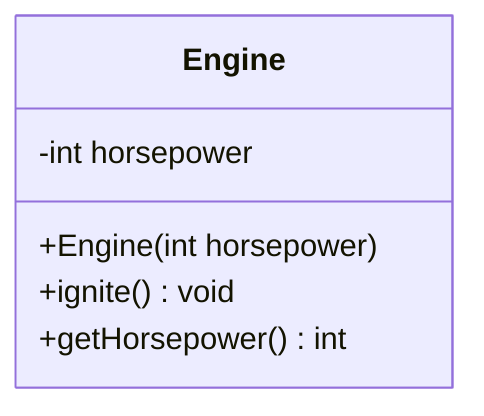

# 類別與物件 (Class & Object)

在 Java 中，**類別 (Class)** 是建立物件的藍圖，而**物件 (Object)** 是類別的實體。類別包含了「屬性 (Attributes)」與「方法 (Methods)」。

:::tip UML 符號說明
- `-` 代表 **private**
- `+` 代表 **public**
:::

## UML 類別圖



## Java 實作

```java
class Engine {
    // 屬性 (Attributes)
    private int horsepower;

    // 建構子 (Constructor)
    public Engine(int horsepower) {
        this.horsepower = horsepower;
    }

    // 方法 (Methods)
    public void ignite() {
        System.out.println("🔥 引擎啟動！馬力：" + this.horsepower + " HP");
    }

    public int getHorsepower() {
        return this.horsepower;
    }
}

public class Main {
    public static void main(String[] args) {
        // 實例化物件 (Instantiation)
        Engine myEngine = new Engine(250);
        myEngine.ignite();
    }
}
```

## 執行結果

```
🔥 引擎啟動！馬力：250 HP
```
