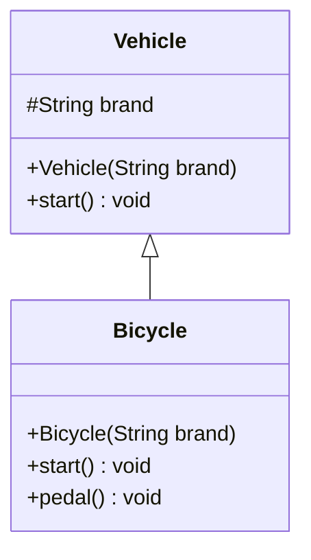

# 繼承關係 (Inheritance)

繼承允許我們建立一個基底類別 (父類別)，並從中衍生出更具體的子類別。達到程式碼重用的目的。

:::tip UML 符號說明
- `#` 代表 **protected**
- 空心箭頭 `<|--` 表示**繼承關係**
:::

## UML 類別圖



## Java 實作

```java
abstract class Vehicle {
    protected String brand; // 子類別可存取

    public Vehicle(String brand) {
        this.brand = brand;
    }

    public void start() {
        System.out.println(this.brand + " 準備出發。");
    }
}

// 繼承使用 extends 關鍵字
class Bicycle extends Vehicle {
    public Bicycle(String brand) {
        super(brand); // 呼叫父類別建構子
    }

    @Override
    public void start() {
        System.out.println("🚲 跨上腳踏車 [" + this.brand + "]...");
    }

    public void pedal() {
        System.out.println("雙腳踩踏板，腳踏車前進中。");
    }
}

public class Main {
    public static void main(String[] args) {
        Bicycle bike = new Bicycle("捷安特");
        bike.start(); // 呼叫覆寫的方法
        bike.pedal();
    }
}
```

## 執行結果

```
🚲 跨上腳踏車 [捷安特]...
雙腳踩踏板，腳踏車前進中。
```
