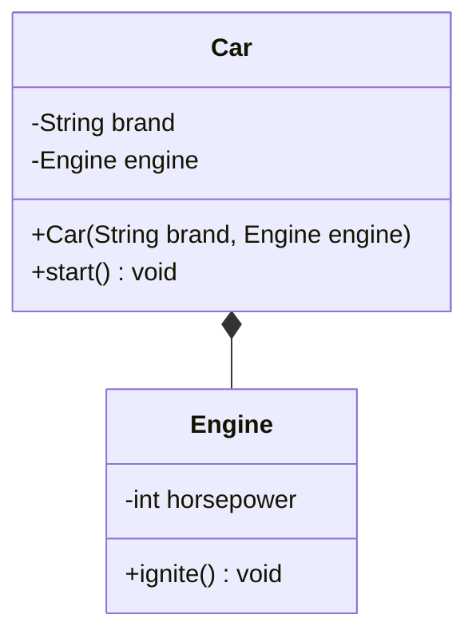

# 組合關係 (Composition)

組合是一種「部分與整體」的關係。例如，一台汽車「擁有」一顆引擎。如果汽車被銷毀，引擎通常也不再獨立存在。

:::tip UML 符號說明
- 實心菱形 `*--` 表示**組合關係**
:::

## UML 類別圖



## Java 實作

```java
class Engine {
    private int hp;
    public Engine(int hp) { this.hp = hp; }
    public void ignite() {
        System.out.println("🔥 引擎轟鳴！(" + this.hp + " HP)");
    }
}

class Car {
    private String brand;
    private Engine engine; // 組合關係

    public Car(String brand, Engine engine) {
        this.brand = brand;
        this.engine = engine; // 將引擎組裝進汽車
    }

    public void start() {
        System.out.println("🚗 啟動汽車 [" + this.brand + "]...");
        this.engine.ignite(); // 委託引擎執行啟動邏輯
    }
}

public class Main {
    public static void main(String[] args) {
        Engine v8 = new Engine(450);
        Car porsche = new Car("Porsche 911", v8);
        porsche.start();
    }
}
```

## 執行結果

```
🚗 啟動汽車 [Porsche 911]...
🔥 引擎轟鳴！(450 HP)
```
