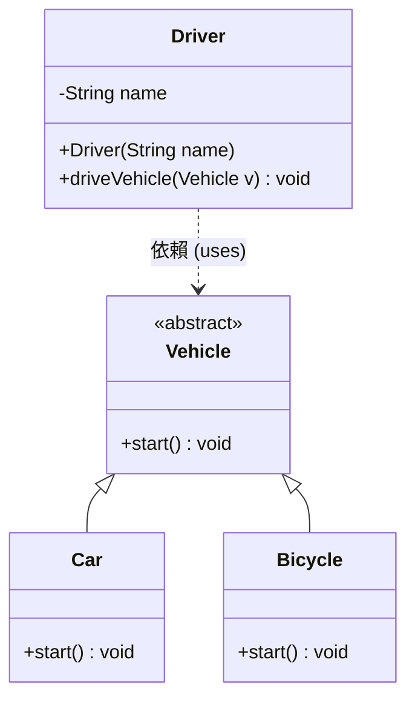

# 多型與依賴 (Polymorphism)

多型允許不同類別的物件對同一方法做出不同回應。依賴則是某個類別的方法使用了另一個類別。

:::tip UML 符號說明
- 虛線箭頭 `..>` 表示**依賴關係**
:::

## UML 類別圖



## Java 實作

```java
abstract class Vehicle {
    public abstract void start();
}

class Car extends Vehicle {
    public void start() { System.out.println("🚗 汽車引擎啟動..."); }
}

class Bicycle extends Vehicle {
    public void start() { System.out.println("🚲 腳踏車踏板準備就緒..."); }
}

class Driver {
    private String name;
    public Driver(String name) { this.name = name; }

    // 依賴於父類別 Vehicle，展現多型
    public void driveVehicle(Vehicle v) {
        System.out.println("👤 駕駛 " + this.name + " 準備操作：");
        v.start(); // 執行時期動態綁定
    }
}

public class Main {
    public static void main(String[] args) {
        Driver leo = new Driver("Leo");
        Vehicle myCar = new Car();
        Vehicle myBike = new Bicycle();

        leo.driveVehicle(myCar);
        System.out.println("---");
        leo.driveVehicle(myBike);
    }
}
```

## 執行結果

```
👤 駕駛 Leo 準備操作：
🚗 汽車引擎啟動...
---
👤 駕駛 Leo 準備操作：
🚲 腳踏車踏板準備就緒...
```
