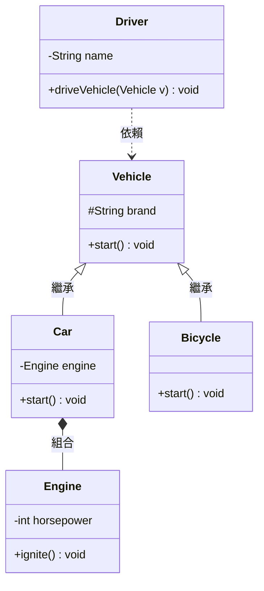

# 綜合系統總覽 (System View)

透過 UML 全域視角，你可以清晰地看到整個系統的依賴、組合與繼承架構。這展現了物件導向中「高內聚、低耦合」的設計美學。

## UML 系統架構圖



## 架構審查重點

### 1. 擴充性 (Extensibility)

如果我們要新增「機車 (Motorcycle)」，只需要繼承 `Vehicle` 類別，完全不需要修改 `Driver` 類別！這符合**開閉原則 (OCP)**。

### 2. 鬆耦合 (Loose Coupling)

`Driver` 類別依賴於抽象的 `Vehicle`，而不是具體的 `Car`。這使得系統的模組之間關聯度降低，更易於維護與測試。

### 3. 模組化 (Modularity)

`Engine` 的邏輯獨立於 `Car` 之外。如果未來要升級引擎邏輯，只需修改 `Engine` 類別。

## Java 驗證

```java
public class ReviewApp {
    public static void main(String[] args) {
        System.out.println("✅ 系統架構審查完畢，完美體現 OOP 精神！");
    }
}
```

## 執行結果

```
✅ 系統架構審查完畢，完美體現 OOP 精神！

🎉 恭喜你完成了 Java UML 視覺化基礎課程！
```
